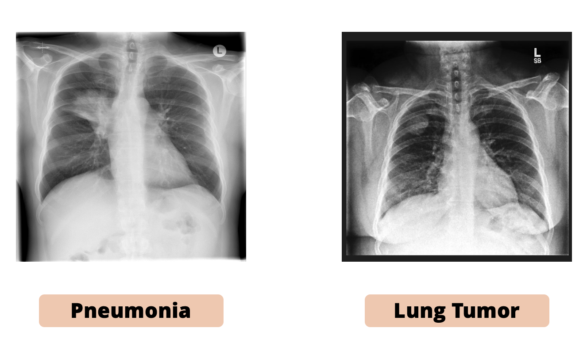
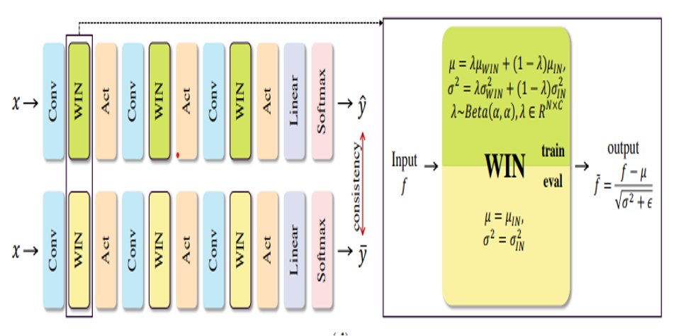
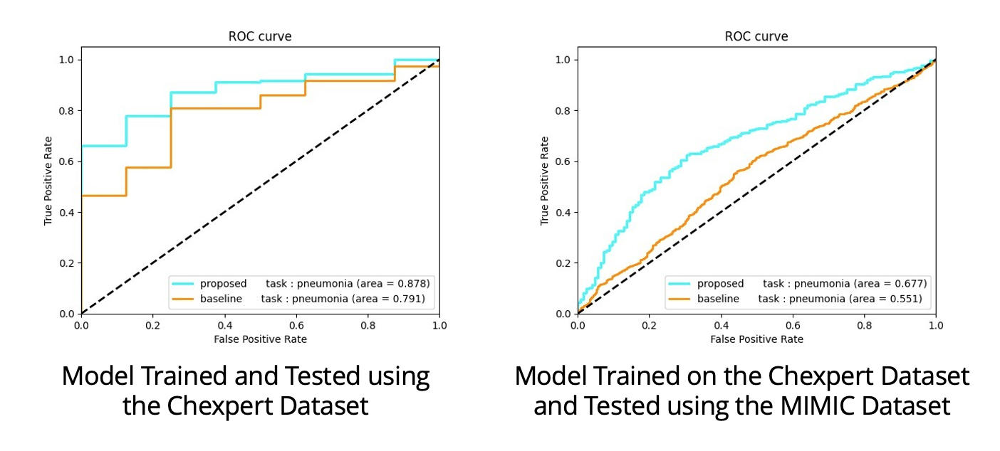

## Table of Contents
1. [Introduction](#introduction)
2. [Problem Statement](#problem-statement)
3. [Our Solution](#our-solution)
4. [Methodology](#methodology)
5. [Results](#results)
6. [Limitations](#limitations)
7. [Future Opportunities](#future-opportunities)
8. [Team](#team)
9. [Resources](#resources)

---

## Introduction
This project was developed by our multidisciplinary team of undergraduate students, graduate researchers and medical professionals and was designed for the NUS-MIT SHADE Medical AI Competition 2022, where we achieved second place. Leveraging cutting-edge AI methodologies, our goal was to create an innovative tool for pneumonia detection and screening for underlying lung tumors.

---

## Problem Statement
Pneumonia is a common diagnosis in clinical settings, often seen in chest radiographs. However, differentiating pneumonia from early-stage lung tumors is challenging, which can delay critical care. The following provides an radiographic illustrations of pneumonia and early-stage lung cancer respectively: 

### Why It Matters
- **Impact of COVID-19**: Increased pneumonia cases have burdened healthcare systems.
- **Aging Population**: Older adults are more susceptible to respiratory illnesses.
- **Clinical Challenges**: Misdiagnosis leads to unnecessary imaging, delayed care, and higher radiation exposure.

---

## Our Solution
We propose a **Distribution-Regularized Convolutional Neural Network (DR-CNN)** to enhance pneumonia detection while aiding in the screening of possible underlying lung tumors. 

### Highlights:
- Trained on the **CheXpert Dataset** (Stanford) with 223,316 chest X-rays from 65,240 patients.
- Incorporated 14 distinct labels derived from radiology reports, including key findings such as "Pneumonia" and "Lung Lesion."
- Focused on robust generalization across heterogeneous medical images.

---

## Methodology
1. **Model Architecture**:
   - Backbone: **AlexNet** trained to simulate radiologist decision-making.
   - Key Enhancements:
     - **Domain Adaptation**: Distribution regularization for better handling of image variability.
     - **Image Augmentation**: Simulations for diverse institutional standards.
     - **Window Normalization**: Improved generalization across datasets.

2. **Datasets**:
   - Training: **CheXpert Dataset**.
   - Testing: **MIMIC Dataset** for external validation.

3. **Explainability**:
   - Integrated attention mechanisms for interpretable predictions.
   - Outputs categorized into:
     - “Pneumonia”
     - “Further attention required”
     - “Others” (e.g., Pleural Effusion).

---

## Results
- **Baseline Model**:
  - Effective in identifying pneumonia.
- **Robust Model**:
  - Outperformed baseline in handling heterogeneity across datasets.
- Potential to reduce over-diagnosis and improve clinical confidence.

---

## Limitations
- The dataset lacks specific labels for lung tumors, requiring practitioner intervention for tumor diagnosis.
- Radiographs are not confirmed via CT or histological methods.
- Further work is needed for tumor-specific predictions.

---

## Future Opportunities
1. Expand robustness for nationwide adoption across healthcare institutions.
2. Develop high-specificity tumor prediction models integrated with other diagnostic modalities (e.g., CT, histology).
3. Reduce healthcare burden by enhancing triaging and prioritization of critical cases.

---

## Team
- **Juncheng**
- **Jacob**
- **Yurui**
- **Yingnan**
- **Srinivasan**
- **Shreyas**

---
## Awards
- Secured First-Runner-Up position in the competition for our proposed and implemented solution.

---
## Resources
- **Dataset**: [CheXpert Dataset](https://stanfordmlgroup.github.io/competitions/chexpert/)
- **Research Papers**: [Example Paper on Robust AI](https://proceedings.nips.cc/paper/2020/file/201d7288b4c18a679e48b31c72c30ded-Paper.pdf)

---

## Acknowledgments
This project is dedicated to improving healthcare outcomes through innovation and teamwork. Thank you to the competition organizers and my team for this incredible opportunity.
